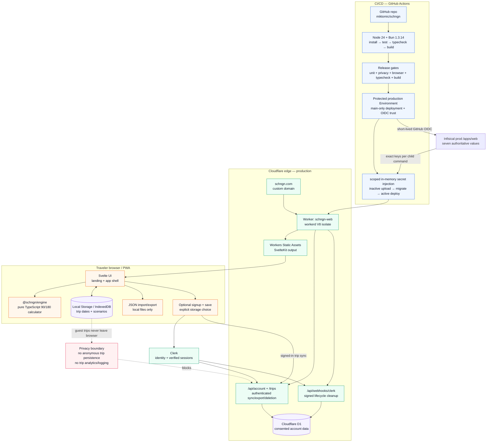

# SCHNGN App Architecture Diagram

This diagram captures SCHNGN’s local-first browser app, optional Clerk accounts, consented authenticated D1 sync, pure calculation engine, and GitHub Actions deployment pipeline.

## Important aspects

### 1. Trip data is local-first by design

Guest trip dates, scenarios, and calculated personal travel timelines stay in browser storage. Choosing a clearly labelled signup-and-save action is the explicit storage choice; after Clerk completes account creation, the current local trips are stored through the authenticated account API. Trip data never enters analytics or logs.

### 2. The Schengen engine is isolated from UI and infrastructure

`packages/engine` is pure TypeScript. It owns the 90/180-day logic for explicit Schengen stay ranges: inclusive entry/exit counting, rolling 180-day windows, overlap de-duplication, remaining days, over-limit state, and latest safe exit calculations. Optional border countries and outside-Schengen break editing remain web-layer concerns.

That package must stay free of browser APIs, Cloudflare APIs, network calls, filesystem access, Bun-native APIs, and UI code. This keeps the safety-critical part testable and boring. Boring is a feature when border control is involved.

### 3. Cloudflare serves the app and stores only consented account data

Production runs at `https://schngn.com` on Cloudflare Workers + Workers Static Assets:

- `schngn-web` is the Worker name.
- Static assets are the SvelteKit/Vite output.
- `workerd` is the production runtime, not Node and not Bun.
- The dynamic Worker surface remains narrow: authenticated `/api/account` and `/api/account/trips`, plus the signed `/api/webhooks/clerk` route.
- Account rows are keyed by the Clerk user ID derived from the verified session; client-supplied ownership is ignored/rejected.

Fresh D1 databases begin with the account schema at migration `0002`. Forward migration `0005_drop_waitlist_signups.sql` idempotently removes the retired table from any already-provisioned database. The product does not expose the former route or write new rows to that table.

### 4. Signup goes directly through Clerk

SCHNGN does not manage a separate email list. The save-labelled signup action opens Clerk in a SCHNGN-themed in-page overlay, while Clerk continues to own identity and session data. Completing account creation returns to the same app and automatically saves the current browser-local trips to the new account.

### 5. Optional account storage is explicit and reversible

Clerk is the identity source of truth. A guest remains local-only. Clicking “Sign up & save” or “Create account & save trips” explicitly chooses account storage, which begins automatically after signup completes. Ordinary sign-in to an existing account still reconciles browser and account copies without silently overwriting either. Account storage includes authenticated export and deletion, plus signature-verified Clerk lifecycle cleanup; no trip data is allowed in analytics or logs.

### 6. CI/CD gates deployment on correctness and build health

GitHub Actions uses:

- Node 24 from `.node-version` / `.nvmrc` for Node-based tooling and GitHub JavaScript actions.
- Bun 1.3.14 for install, tests, typecheck, build, and deploy scripts.
- Wrangler for Cloudflare deploy.

Pipeline shape:

1. `bun install --frozen-lockfile`
2. `bun run test`
3. `bun run typecheck`
4. `bun run build`
5. `bun run test:e2e`
6. deploy on `main` through the `production` GitHub Environment

### 7. Infisical is authoritative; GitHub provides short-lived identity

The protected GitHub Environment `production` gates main-branch deployment and defines the trusted OIDC subject. It stores no copies of SCHNGN's seven production values. The deploy job alone has `id-token: write` and exchanges GitHub's short-lived token directly with Infisical identity `812097c6-b028-4a21-9af0-291ebc835cfa`, whose access is limited to read/describe on `prod` `/apps/web`. There is no Infisical Secret Sync and no long-lived Infisical token in GitHub.

The repository wrapper retrieves and validates the complete set in memory, removes OIDC/Infisical authentication material, and starts each child from a benign environment allowlist plus only the keys it needs. Missing or invalid configuration fails deployment instead of skipping it. The production workflow writes the five Worker runtime bindings to a mode-`0600` file in `RUNNER_TEMP`, deletes it after inactive upload and before migrations, recreates it only for active deploy, and deletes it again even when deployment fails. A non-cancelling concurrency group serializes production jobs.

These values must never be committed, printed in logs, or copied into docs, GitHub Actions secrets, or GitHub Actions variables.

### 8. External production closeout

The remaining environment-owned work is explicit: configure the Clerk production domain/webhook, provision/apply D1, register `schngn.com` in Plausible, and verify the canonical `www` redirect after deployment. The least-privilege Infisical OIDC identity and main-only GitHub `production` Environment are configured. See `docs/production-readiness.md`.

## Source files represented

- `packages/engine/`
- `apps/web/`
- `apps/web/src/routes/api/account/+server.ts`
- `apps/web/src/routes/api/account/trips/+server.ts`
- `apps/web/src/routes/api/webhooks/clerk/+server.ts`
- `apps/web/wrangler.jsonc`
- `.github/workflows/ci.yml`
- `docs/architecture.md`
