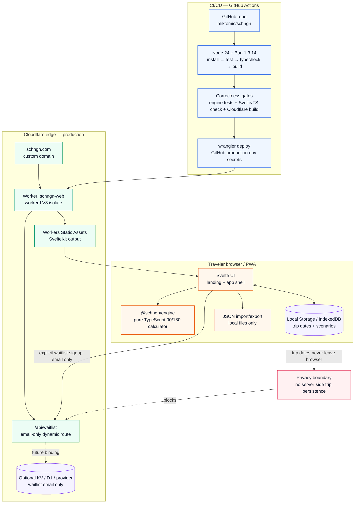

# SCHNGN App Architecture Diagram

This diagram captures the current SCHNGN MVP architecture: local-first browser app, pure calculation engine, tiny Cloudflare Worker surface, and GitHub Actions deployment pipeline.

## Important aspects

### 1. Trip data is local-first by design

Trip dates, scenarios, and calculated personal travel timelines stay in the traveler’s browser storage. The browser may use Local Storage or IndexedDB, but the architectural rule is the same: **no trip history is sent to Cloudflare, analytics, or any server endpoint**.

### 2. The Schengen engine is isolated from UI and infrastructure

`packages/engine` is pure TypeScript. It owns the 90/180-day logic: inclusive entry/exit counting, rolling 180-day windows, overlap de-duplication, included/excluded countries, remaining days, over-limit state, and latest safe exit calculations.

That package must stay free of browser APIs, Cloudflare APIs, network calls, filesystem access, Bun-native APIs, and UI code. This keeps the safety-critical part testable and boring. Boring is a feature when border control is involved.

### 3. Cloudflare serves the app, but does not own trip data

Production runs at `https://schngn.com` on Cloudflare Workers + Workers Static Assets:

- `schngn-web` is the Worker name.
- Static assets are the SvelteKit/Vite output.
- `workerd` is the production runtime, not Node and not Bun.
- The current dynamic Worker surface is intentionally tiny: `/api/waitlist`.

### 4. `/api/waitlist` is email-only

The waitlist route may accept an email address for validation/fake-door demand testing. It must not accept trip dates, travel history, names, passport details, residence status, or legal-context payloads.

Storage for waitlist email is optional/future:

- Cloudflare KV, or
- Cloudflare D1, or
- a separate provider.

No waitlist storage is required for the core local calculator.

### 5. CI/CD gates deployment on correctness and build health

GitHub Actions uses:

- Node 24 from `.node-version` / `.nvmrc` for Node-based tooling and GitHub JavaScript actions.
- Bun 1.3.14 for install, tests, typecheck, build, and deploy scripts.
- Wrangler for Cloudflare deploy.

Pipeline shape:

1. `bun install --frozen-lockfile`
2. `bun run test`
3. `bun run typecheck`
4. `bun run build`
5. deploy on `main` through the `production` GitHub Environment

### 6. Secrets stay in GitHub Environment, not the repo

Cloudflare credentials are injected only during the production deploy job:

- `CLOUDFLARE_API_TOKEN`
- `CLOUDFLARE_ACCOUNT_ID`

These values must never be committed, printed in logs, or copied into docs.

### 7. Current architectural gaps to close before launch

- Expand `packages/engine` to the full EC-parity fixture/property/golden-master suite from US-01.
- Add actual local trip CRUD + persistence in `apps/web`.
- Add JSON import/export.
- Add privacy-safe analytics only after payload inspection.
- Decide whether `www.schngn.com` redirects to apex.
- Choose KV/D1/provider only if/when waitlist capture becomes real.

## Source files represented

- `packages/engine/`
- `apps/web/`
- `apps/web/src/routes/api/waitlist/+server.ts`
- `apps/web/wrangler.jsonc`
- `.github/workflows/ci.yml`
- `docs/architecture.md`
