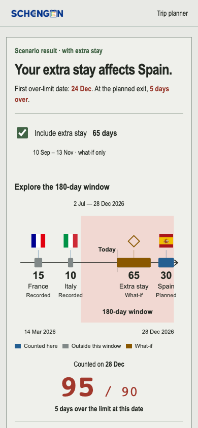
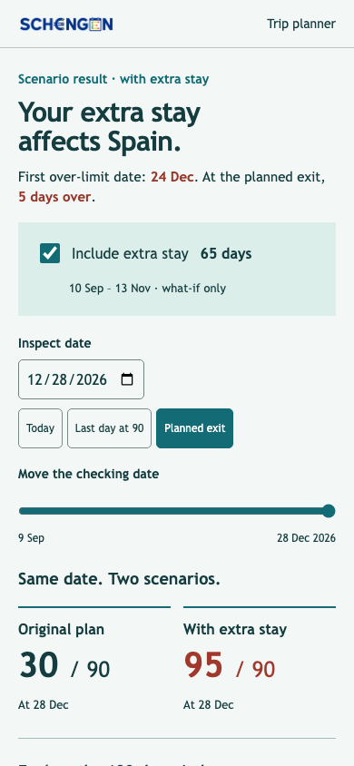
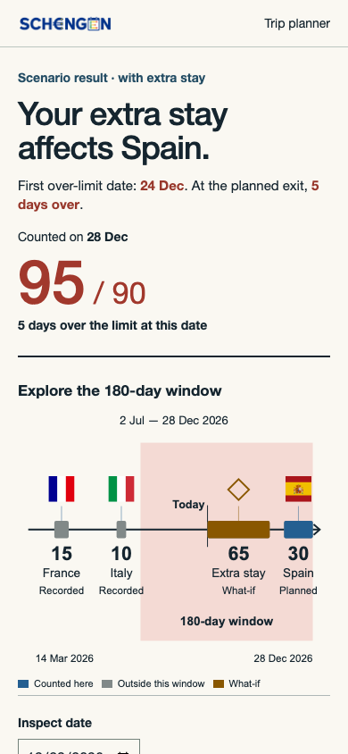

# Independent design review: moving-window screen

**Review type:** report-only visual and interaction review

**Reviewer:** independent design-review pass

**Date:** 2026-09-10

**Surfaces reviewed:** `/app#timeline`, `/app#trips`, and the synthetic moving-window example on `/explainer`.

**Viewport evidence:** 390×844, 320×700, and 1280px desktop captures. The reference set is the six supplied 390×844 screenshots showing one teaching sequence: two past stays, one future stay, a moving 180-day band, a Today marker, and a large counted-days total.

**Scope constraint:** This review did not edit production code, tests, or prototypes. The active working tree was already dirty from the moving-window implementation, so the review treated it as a shared read-only surface.

## First impression

The screen communicates a serious, trustworthy planning aid. The saved status answer is strong on the app surface: “65 safe buffer days” is the first thing I see, followed by the saved date, latest safe exit, and a short explanation. The moving-window example has the right core picture: one axis, square country flags, a translucent 180-day band, a Today line, and a large `25 / 90` or `95 / 90` result.

I notice two competing readings. The app asks me to trust the saved result at the top, then invites me to move the date and see a different answer lower down. The implementation labels the saved checkpoint below the controls, so the distinction is available but not present at the moment a changed count is most visually dominant. A traveler can see “95 / 90” in the explorer and “65 safe buffer days” in the page’s primary status without an immediate on-screen relationship between them.

The first three things my eye goes to on the canonical mobile screen are:

1. the large saved status, such as “65 safe buffer days”;
2. the timeline card and its moving window;
3. the large counted-days fraction.

That hierarchy is mostly right. The timeline itself is one visual object now, which is the important improvement over the earlier stacked ledger. The remaining problem is context: the explored date and saved date need to be visually paired whenever they differ.

If I had to describe the current result in one word: **credible**. It is close to the supplied visual language, but it is still a calculator workspace with an explanation attached rather than a single, authored teaching composition.

## What data this screen communicates

The primary screen contains several different kinds of data. They need different visual weight and labels because users should not have to infer which values are authoritative, exploratory, or explanatory.

| Data group | Current visible data | User question it answers | Design requirement |
|---|---|---|---|
| Saved decision | Status chip, safe buffer or over-limit amount, saved/reference date, latest safe exit | “What should I do with my saved plan?” | Keep this authoritative and visually stable while the explorer changes. |
| Aggregate rule result | Large `used / 90` fraction, over-by or safe-buffer sentence | “How many counted days are in this checked window?” | Make the checked date explicit beside or immediately above the fraction. |
| Rolling window | 180-day range, translucent band, window label | “Which 180 calendar days are being counted?” | Distinguish the band’s right edge from Today when the inspected date is in the future. |
| Orientation dates | Today line and label, axis start/end dates | “Where is now, and what part of the axis am I seeing?” | Today is a reference point; it is not always the checked date. |
| Trip evidence | Country flag/marker, duration, generic role label, counted/outside bar | “Which stays are contributing evidence?” | Provide country or trip identity in accessible text and keep marker labels attached to their date. |
| What-if state | Include checkbox, amber stay, diamond marker, future 65-day stay | “What changes if I include this plan?” | Say that the stay is hypothetical and visibly separate it from saved evidence. |
| Date exploration | Slider, native date input, Today and Planned exit/Back to result shortcuts | “What happens on another date?” | Changing it must be clearly framed as exploration, not an edit to saved trips. |
| Evidence details | Collapsed per-trip date/count disclosure and saved forecast disclosure | “Can I audit the arithmetic?” | Keep exact dates available without competing with the primary picture. |

The current synthetic example is a useful test case: France 15 days and Italy 10 days in the past, a 65-day what-if stay beginning Today, and a 30-day planned Spain stay. It shows `25 / 90` at Today, `26 / 90` when the first what-if day is included at Today, and `95 / 90` at the planned exit with the what-if included. Those are good state transitions. The interface should make the transition itself the story, instead of making the user remember which count came from which date.

## Findings, ordered by impact

### F-01 — High: saved answer and explored answer need one persistent relationship

**Category:** hierarchy, content clarity, interaction model

**Evidence:** [canonical status at 390px](alternative-design-review-assets/app-top-mobile.png), [canonical timeline at 390px](alternative-design-review-assets/app-timeline-mobile.png), [planned-exit risk state](alternative-design-review-assets/explainer-moving-planned-exit-top-mobile.png)

**I notice:** The app’s first screen says “65 safe buffer days” for the saved result dated 10 May 2026. The moving-window panel can then show a different checked date and a different count, such as `95 / 90` on 28 Dec 2026. The panel does contain “Saved result · …” and a saved fraction below the controls, but that context is easy to miss while the large explored fraction is in view.

**I wonder:** Will a traveler understand that `95 / 90` is a what-if or future inspection while their saved answer above remains `65 safe buffer days`? On a 390px screen, the two states are separated by scroll, which increases the chance of treating the explored result as a newly saved verdict.

**What if:** When `checkingDate !== referenceDate`, add a compact, always-visible context line directly above the large fraction: “Exploring 28 Dec · saved result 10 May: 25 / 90.” Keep the saved status unchanged, and make the return action use the same words, “Back to saved result.” On the explainer, “Planned exit” can remain the teaching label, but it should still identify the result as a scenario.

**Acceptance evidence:** Scrubbing to any date shows both the checked date and the saved checkpoint without requiring the disclosure to be opened. The saved status and saved forecast remain visibly separate.

### F-02 — High: the explainer is a long document where the reference is a focused visual sequence

**Category:** composition, responsive hierarchy, content design

**Evidence:** [full explainer capture](alternative-design-review-assets/explainer-desktop.png), [moving example at 390px](alternative-design-review-assets/explainer-moving-mobile.png), and the supplied reference frame 1 at `/tmp/codex-remote-attachments/01a0881c-f791-7c90-b22b-d83e955eca36/6AD2ED02-F4B6-41BA-9585-FB99AA548C7C/1-Photo-1.jpg`.

**I notice:** The supplied reference uses a short six-state teaching sequence with a title, progress dots, one sentence, one diagram, and one large result. The current `/explainer` places the moving example after the rule walkthrough and country guide, roughly thousands of pixels down the page. Its section itself is clear, but it does not feel like the same authored “why the window moves” moment.

**I wonder:** Is the goal of this screen to teach the rule or to let the traveler plan? The current surface tries to do both in one scroll path, so the most important diagram arrives after several unrelated explanatory blocks.

**What if:** Give the moving-window lesson a dedicated, compact sequence before the country directory, or make it a distinct “Why this window moves” step reachable from the status/timeline. Each step should preserve the same axis and vary only one state: baseline, window moved, what-if included, planned exit, over-limit, rule summary. The planner can keep the full controls below the authored sequence.

**Acceptance evidence:** A new user reaches the baseline diagram and its `25 / 90` result without scrolling through the country list. The current `/app` remains a task-focused workspace rather than becoming a carousel.

### F-03 — High: chart semantics do not expose the complete visual model to screen readers

**Category:** accessibility, data communication

**Evidence:** [interactive risk annotated capture](alternative-design-review-assets/explainer-risk-annotated.png), rendered accessibility snapshot, [planned-exit risk state](alternative-design-review-assets/explainer-moving-planned-exit-top-mobile.png)

**I notice:** The moving example exposes the checkbox, slider, date input, and shortcut buttons well. It also exposes the large fraction and summary text. The timeline itself is exposed mostly as a generic text block: date range, “15 days Earlier stay,” “10 days Recent stay,” and “30 days Planned stay.” The window band, Today line, counted/outside distinction, flags, and what-if diamond are visual-only for this region. The static timeline has a richer image description and legend, but the moving example does not provide the same model.

**I wonder:** Can a screen-reader user tell which stays are inside the current window, where Today sits, or why the count changed after moving the slider? The control result is announced through the polite live region, but the underlying evidence that explains it is not.

**What if:** Treat the chart as a labeled region with a concise dynamic description and a linked details list. For example: “Timeline checked on 28 Dec 2026. The 180-day window is 2 Jul–28 Dec. France 15 and Italy 10 are outside this window; the what-if stay contributes 65 and Spain contributes 30; total 95 of 90, five over.” Keep the visual chart decorative, but expose the same facts in the disclosure and ensure flag images do not carry the only country identity.

**Acceptance evidence:** Keyboard and screen-reader traversal can recover the current window bounds, Today/checking-date relationship, each trip’s role, and the aggregate count without interpreting pixels.

### F-04 — High: dense markers are handled by vertical tiers, but the visual connection is fragile

**Category:** responsive layout, evidence readability

**Evidence:** [canonical timeline with two close trips at 390px](alternative-design-review-assets/app-timeline-mobile.png), [320px baseline](alternative-design-review-assets/explainer-moving-320.png)

**I notice:** In the stored app state, two trips are close enough that the marker labels are lifted into separate vertical tiers. The result avoids direct collision, but the upper marker’s number and duration float well above the axis and the two bars remain only 25px apart. At 320px, the three synthetic markers fit, but the axis is doing a lot of work in a narrow 288px content width.

**I wonder:** When there are four or more stays near the same date, will users know which elevated label belongs to which bar without tracing a thin leader line? The current sample does not exercise that case.

**What if:** Define a visible collision policy for the review fixtures: group nearby entries into a labeled cluster, use a numbered marker with a short evidence list, or reserve a fixed marker rail above the axis. Keep labels transparent as requested, but make every elevated label connect to its bar with a high-contrast, minimum 2px leader and a stable reading order.

**Acceptance evidence:** A fixture with at least 5 close/overlapping stays at 320px and 390px remains readable, and every marker can be paired with its country/trip name and duration without opening details.

### F-05 — Medium: the main chart needs a visible semantic key

**Category:** comprehension, color semantics

**Evidence:** [baseline moving example](alternative-design-review-assets/explainer-moving-mobile.png), [what-if state](alternative-design-review-assets/explainer-moving-risk-mobile.png), [prototype B with legend](alternative-design-review-assets/prototype-B-mobile.png)

**I notice:** The current chart uses gray for outside-window evidence, blue for counted stays, amber for what-if, and a diamond for the hypothetical marker. In the primary viewport there is no compact legend. The detailed disclosure can explain the values later, but a first-time user has to infer the meaning from color and shape.

**I wonder:** Does the gray planned Spain bar mean “not counted yet,” “outside the window,” or “not included because the checkbox is off”? Those are different reasons with different planning implications.

**What if:** Add one short, inline key directly under the axis: “counted · outside this window · what-if,” with text and shape, not color alone. Prototype B demonstrates the benefit at the same mobile width; its legend makes the gray/blue/amber bars legible before the user reaches the count.

**Acceptance evidence:** A first-time user can identify all three bar states without opening a disclosure or knowing SCHNGN’s color system.

### F-06 — Medium: date context is accurate but visually over-specified

**Category:** typography, information architecture

**Evidence:** [390px baseline](alternative-design-review-assets/explainer-moving-mobile.png), [390px risk state](alternative-design-review-assets/explainer-moving-planned-exit-top-mobile.png)

**I notice:** The card presents the current window range near the top, the focused-axis start/end dates under the chart, the Today label in the chart, and a checking-date field below. All are valid, but they have similar visual weight. At 390px the user sees “15 Mar 2026 – 10 Sept 2026,” “14 Mar 2026,” “28 Dec 2026,” “Today,” and the date input in one compact vertical span.

**I wonder:** Which date should I read first: the window end, Today, the axis end, or the checking date? The answer is clear to the engine but not immediately clear to a traveler scanning the card.

**What if:** Name the roles in the UI: “Window: 15 Mar–10 Sep,” “Checked on: 10 Sep,” and “Axis: 14 Mar–28 Dec.” In the teaching version, keep only the window range and the large result in the primary frame; put full axis bounds in details.

**Acceptance evidence:** At a glance, a user can state the checked date and the 180-day window without mentally mapping unlabeled date lines.

### F-07 — Medium: the hypothetical stay is visually distinct but its planning status is not explicit enough

**Category:** content, interaction feedback

**Evidence:** [what-if included at Today](alternative-design-review-assets/explainer-moving-risk-mobile.png), [what-if included at planned exit](alternative-design-review-assets/explainer-moving-planned-exit-top-mobile.png)

**I notice:** The checkbox says “Include what-if stay · 65 days,” the bar turns amber, and the diamond separates it from country flags. That is a good visual distinction. The planned Spain stay remains gray when it is not counted at Today, but the chart says only “Planned stay,” so the reason for the gray treatment is left to inference.

**I wonder:** Will users read the amber 65-day bar as an already-booked trip, or understand that it is a scenario input that changes only the explored result?

**What if:** Use explicit status words alongside each marker: “past,” “what-if,” and “planned.” Keep the checkbox as the inclusion control and add a one-line helper only when the scenario is active: “Scenario only; your saved trips are unchanged.”

**Acceptance evidence:** Including and excluding the what-if changes the explored count while a visible saved-result label and the saved trip list remain unchanged.

### F-08 — Medium: the amber window label is just below the text contrast target

**Category:** color and contrast

**Evidence:** [baseline mobile](alternative-design-review-assets/explainer-moving-mobile.png)

**I notice:** The amber “Rolling 180-day window” label sits on the beige band. The measured contrast is approximately 4.16:1 for the rendered amber and band colors, below the 4.5:1 body-text target. The risk red label on the salmon band is approximately 4.66:1, and the main ink/secondary text pairs pass comfortably.

**What if:** Darken the amber label or use the primary ink color on the band. Keep amber as the semantic accent for what-if/risk context, but do not make the band label the only low-contrast text in the core diagram.

**Acceptance evidence:** The label passes 4.5:1 at its actual rendered size, and the semantic color system remains distinguishable without color vision.

### F-09 — Medium: flags are square visually but not available as country names in the accessible model

**Category:** accessibility, content

**Evidence:** Rendered DOM inspection of the moving example shows the 32×32 flag images have empty `alt` text and are inside an `aria-hidden` marker-symbol wrapper. The visual evidence is clear in [the risk state](alternative-design-review-assets/explainer-moving-planned-exit-top-mobile.png), but the accessible snapshot exposes only generic labels such as “Earlier stay” and “Planned stay.”

**I wonder:** If a traveler uses a screen reader or cannot distinguish the flag artwork, how do they know which stay is France, Italy, or Spain?

**What if:** Keep the square flags and transparent text treatment, but include the country/trip identity in the marker’s accessible name and in the details list. If the flag is intentionally decorative, the adjacent text must carry the country name instead of the generic “Earlier stay.”

**Acceptance evidence:** Each marker is announced as country/trip role plus duration and counted status, without requiring the visual flag.

### F-10 — Polish: the planner control row is functional but duplicates two date-selection mechanisms

**Category:** interaction economy, mobile rhythm

**Evidence:** [390px keyboard focus](alternative-design-review-assets/explainer-keyboard-focus.png), [320px lower panel](alternative-design-review-assets/explainer-moving-320-lower.png)

**I notice:** The slider, native date input, Today button, and Planned exit/Back to result action are all useful. At 320px, the disclosure summary wraps to two lines and the controls push the saved checkpoint below the fold. The 44px touch targets and visible keyboard focus are good.

**What if:** Keep the slider as the primary exploratory control and make the date field a compact “Choose date” disclosure, or keep the date field and reduce the shortcut row to one context-sensitive action. Preserve the native date input for direct entry and keyboard users.

**Acceptance evidence:** The mobile card keeps the checked date, large result, and saved-vs-explored context visible before the disclosure while retaining an accessible direct date path.

## Prototype comparison: B, C, and H

These are useful reference points from the local design board. They are not production code and were reviewed only for clarity.

### B — “The travel instrument”

Prototype B is the closest to a practical planner. It puts the scenario result first, states the first over-limit date, then shows the checkbox, one axis, a visible legend, and the count. Its strongest lesson is the small legend: “Counted here,” “Outside this window,” and “What-if” remove the chart’s color ambiguity immediately.

Its weakness is that “Your extra stay affects Spain” assumes the user already understands why Spain is the affected trip. It also compresses the first over-limit date and planned-exit consequence into one paragraph. Keep the sentence, but make the date and the planned exit two separate facts with the same semantic hierarchy used by the app’s saved status.

### C — “See the consequence”

Prototype C has the clearest scenario comparison: “Same date. Two scenarios.” with `30 / 90` and `95 / 90` side by side. The date field and “Last day at 90” shortcut make the planning task explicit. This direction is strong for decision-making because it shows what changes while holding the date constant.

Its weakness is ordering. The timeline is below the comparison, so the explanatory visual is absent from the first viewport. If this direction is selected, keep a compact axis preview above or immediately beside the two-scenario result rather than making the user scroll to understand the consequence.

### H — “Time, precisely arranged”

Prototype H has the strongest first viewport for the most important question: `95 / 90`, “5 days over the limit at this date,” then the axis. It makes the consequence legible before asking the user to interpret the diagram. The axis retains the single-line composition, square flags, transparent labels, and visible legend.

Its weakness is that the date-control section begins below the first viewport. That is acceptable for a read-first warning state, but a planner needs a clear path to change the date without hunting. H is the best hierarchy model for risk; C is the best scenario-comparison model; B is the best evidence/legend model.

## Interaction and responsive checks

- The native slider is keyboard-operable. Moving one step left changed the checked date from 28 Dec 2026 to 27 Dec 2026 and the result from `95 / 90` to `94 / 90` without changing the saved checkpoint. The visible focus ring is clear and the slider is 44px high.
- The direct date input exposes min/max bounds and a localized `aria-valuetext` on the slider. Today and Planned exit shortcuts are exposed as buttons, with disabled state when already at the selected date.
- The result container has `aria-live="polite"`, so the large count is announced when the date changes. The chart evidence still needs the semantic summary described in F-03.
- At 320px there is no horizontal overflow in the moving example. The one-axis composition remains intact, but the marker rail and two-line disclosure summary are at the limit of comfortable density.
- The 390px app status hierarchy is strong: status, saved date, safe buffer, latest safe exit, days used, and “Why this answer” fit in one screen. The timeline begins below that answer, which supports a read-first app flow.
- The explainer route produced no console errors after reload. The earlier app/editor navigation emitted a native date-format warning before reload, but it did not recur on the isolated explainer route. Treat that as a separate editor-state check rather than evidence against the moving-window chart.

## Inferred design system

- **Type:** Source Sans 3 for UI and headings, IBM Plex Mono for date/numeric strings. This is a good product-specific pairing and avoids the generic system-font look.
- **Palette:** warm paper `#F7F5EF`, deep ink `#10231F`, green `#0F6B4F`, blue `#1F5F9F`, amber `#8A5A00`, risk red `#A8322A`, beige window band, and salmon risk band. The palette is restrained and semantically coherent.
- **Hierarchy:** the app uses a strong display scale for the status and a compact 17–28px scale inside the timeline card. The large count is the correct anchor below the axis.
- **Shape language:** restrained borders and square-ish controls support a public-service / instrument feel. The square flag treatment fits the requested reference better than circular flags.
- **Text treatment:** the timeline labels are transparent, which respects the user’s explicit request and lets the axis remain one continuous visual object.

## Goodwill reservoir

Goodwill starts at 70.

- **+10:** The saved answer is immediate and specific on `/app`: the traveler sees a safe buffer, latest safe exit, days used, and a reason.
- **+5:** Today and planned-exit shortcuts remove repetitive date entry.
- **+5:** The slider and date field provide both direct manipulation and precise entry.
- **+5:** The app keeps the saved result separate from exploratory calculations in the data model and exposes a saved checkpoint.
- **−5:** The chart’s color states require inference until the details disclosure is opened.
- **−5:** The explored result can appear to contradict the saved status when the user scrolls between them.
- **−5:** Dense markers can require tracing elevated labels to their bars on narrow screens.

**Estimated final goodwill: 75/100.** The main experience is credible and careful. The largest remaining drain is the saved-versus-explored mental model, not surface polish.

## Scorecard

These are review baselines for the current rendered surface, not a release gate.

| Category | Grade | Reason |
|---|---:|---|
| Visual hierarchy | B | Strong saved status and large count; saved/explored context is split. |
| Typography | B | Distinctive font pairing and strong fractions; several date roles compete. |
| Spacing and layout | B | Stable axis and responsive card; dense marker tiers need a tested collision policy. |
| Color and contrast | B− | Coherent semantics; amber band label is about 4.16:1. |
| Interaction states | B | Keyboard slider, shortcuts, focus ring, and live result work. |
| Responsive | B− | 390px is comfortable; 320px is readable but close to the density limit. |
| Content quality | B | Copy is specific and restrained; scenario versus saved language needs stronger pairing. |
| AI-slop resistance | A− | No generic dashboard mosaic, purple gradient, or decorative card grid. |
| Motion | B | Date changes update the model directly; no unnecessary animation observed. |
| Performance feel | A− | Local route reached network idle quickly and showed no console errors in the isolated review. |

**Design score:** B

**AI-slop score:** A−

## Quick wins

1. Add a persistent “Exploring [date] · saved result [date]” line next to the large fraction when the dates differ.
2. Add the three-state legend under the axis, using text plus swatches/shapes.
3. Expose country/trip identity in the marker’s accessible name; do not make the square flag the only identity.
4. Darken the amber window label or switch that label to ink to clear the contrast target.
5. Add a dense-marker fixture at 320px and 390px before choosing a final marker layout.

## Recommendation

Keep the production axis and square-flag treatment. Use H’s read-first risk hierarchy, C’s same-date scenario comparison, and B’s inline legend. The final screen should make the saved answer, the checked date, and the resulting `used / 90` number readable as one sentence before asking the traveler to inspect exact trip arithmetic.
